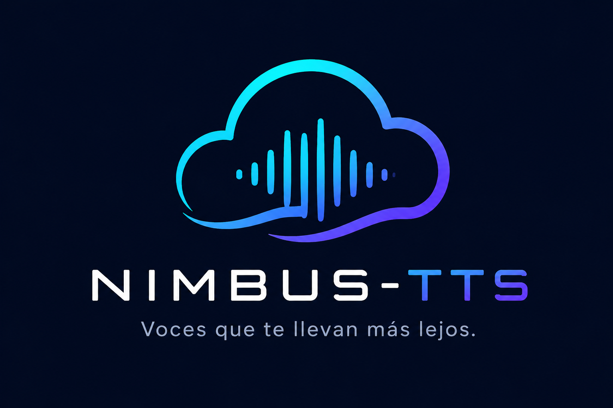

# ☁️ Nimbus-TTS: Voces que te llevan más lejos 🎤

## 🌟 ¿Qué es Nimbus-TTS?
**Nimbus-TTS** nace de la necesidad de transformar la forma en que consumimos información. Mientras que herramientas tradicionales como OneNote o lectores básicos ofrecen voces robóticas y dependencia total de la nube, Nimbus-TTS ofrece una **experiencia humana, privada y potente**.

Este proyecto fue creado para estudiantes, profesionales y entusiastas de la accesibilidad que buscan una herramienta de lectura que no solo lea texto, sino que lo haga con una calidad premium y herramientas de IA integradas para sintetizar el conocimiento.

---

## ✨ Características Principales

### 🎙️ Motores de Voz de Próxima Generación
- **[Premium] Kokoro Engine**: Calidad humana asombrosa en solo 300MB. La excelencia en síntesis de voz local.
- **[Piper] ONNX Models**: Velocidad y eficiencia. Voces naturales que funcionan 100% offline.
- **Nube Híbrida**: Soporte para Azure y Google TTS para máxima versatilidad.

### 🧠 Inteligencia Artificial Integrada
- **Resúmenes Inteligentes**: ¿Texto muy largo? Pide un resumen a través de **Google Gemini** u **OpenAI** y escúchalo al instante.
- **Multimodal**: Preparado para evolucionar hacia el análisis de documentos complejos.

### 🛠️ Productividad sin Fricción
- **Atajos Globales**: Controla la lectura (Play/Pause/Stop) desde cualquier aplicación con hotkeys configurables.
- **Modo Offline Inteligente**: Detección automática de conexión. Si no hay internet, Nimbus te cubre con tus voces locales.
- **Instalador Profesional**: Instalación limpia y segura en Windows.

---

## 🚀 Instalación Quick-Start

1. Descarga el instalador `Nimbus-TTS-Setup.exe` desde la sección de [Releases](https://github.com/Nahuelito22/Nimbus-TTS/releases).
2. Ejecuta el instalador y sigue los pasos.
3. Al iniciar, ve a **Ajustes > Modelos** para descargar tus voces favoritas.
4. ¡Selecciona cualquier texto y presiona tu atajo de teclado para empezar a escuchar!

---

## 🗺️ Roadmap: El Futuro de Nimbus-TTS
Nimbus no se detiene aquí. Nuestra visión es superar cualquier limitación actual de herramientas de toma de notas:

- [ ] **Soporte OCR**: Leer texto directamente desde imágenes o PDFs escaneados.
- [ ] **Traducción en Tiempo Real**: Escucha cualquier texto en tu idioma preferido.
- [ ] **Extensión de Navegador**: Integración directa con Chrome/Edge.
- [ ] **Voces Clonadas**: Posibilidad de añadir tu propia voz al sistema.
- [ ] **Integración con OneNote/Notion**: Sincronización de notas leídas.

---

## 🤝 Contribuciones
¡Las ideas son bienvenidas! Siéntete libre de abrir un issue o un pull request para mejorar esta herramienta.

---

## 📜 Licencia
Desarrollado con ❤️ por **Nahuelito22**.  
*Impulsando la accesibilidad y el aprendizaje inteligente.*